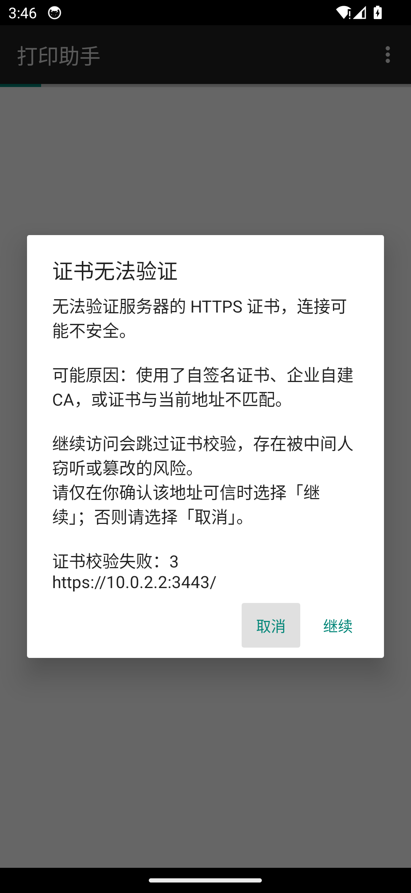
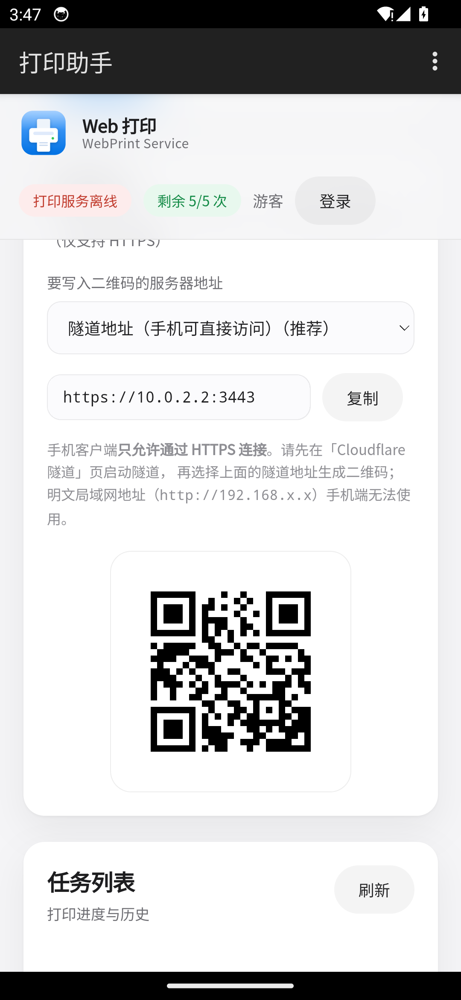
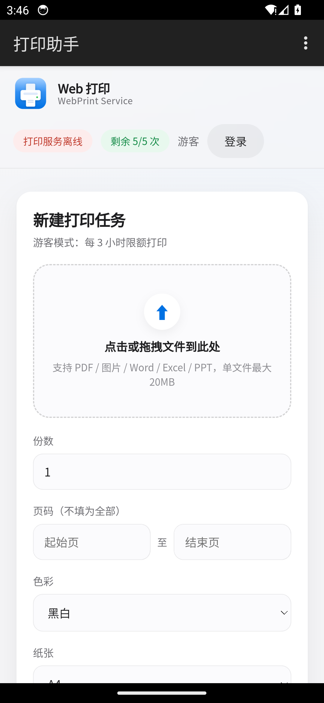
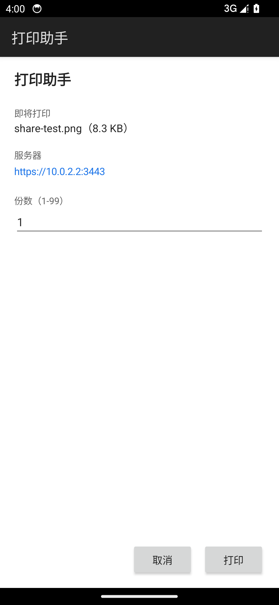
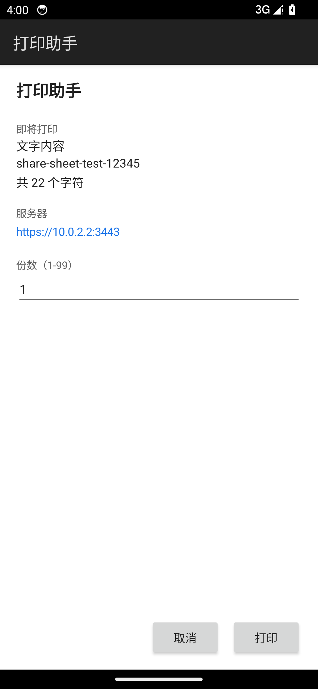
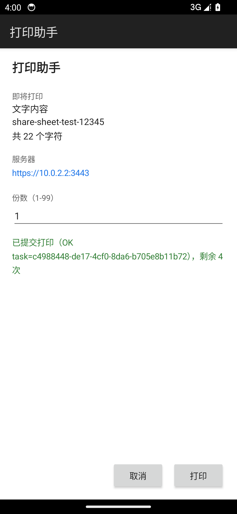
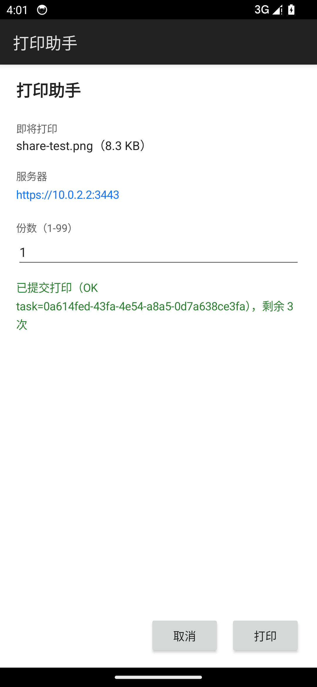

# WebPrint 安卓客户端

对接 [web-print](../readme.md) 自托管打印网关的安卓客户端。

这是一个**薄壳（WebView 容器）**：服务端会装在多台电脑上，客户端只做三件事——记住这些
服务器地址、让用户选一个、加载它的网页。打印、任务队列、配额、登录全部由服务端网页负责，
客户端里没有打印业务逻辑。

之所以不复刻原生界面：服务端网页在手机上已经可用，重写一套原生 UI 的收益不抵它的维护成本。
除了下面几件浏览器做不了的事（扫码、分享面板、原生文件选择）之外，没有必要再维护第二套界面。

客户端只允许 HTTPS 连接（见[已知限制](#已知限制)），所以用之前得先在打印主机上开隧道。

## 界面

截图来自 Android 14 模拟器。

| 服务器列表 | 扫码添加 | 证书确认 |
| :--: | :--: | :--: |
|  |  |  |

| 手机接入二维码 | WebView 网页 | 分享文件 |
| :--: | :--: | :--: |
|  |  |  |

| 分享文字 | 提交成功（文字） | 提交成功（文件） |
| :--: | :--: | :--: |
|  |  |  |

## 功能

| 功能 | 说明 |
| --- | --- |
| 多服务器管理 | 手动添加 / 切换 / 长按删除，可给每台机器起中文别名 |
| 扫码添加 | 扫服务端网页「手机接入」卡片上的二维码，自动填入地址 |
| 网页界面 | WebView 加载服务端网页，登录、上传文件、看任务都在里面 |
| 文件上传 | 实现了 `onShowFileChooser`，网页里的「点击选择文件」在壳内可用 |
| 分享面板打印 | 在微信 / 相册 / 文件管理器里「分享 → 打印助手」直接打印，不用先开 App |
| 页面预览与页码 | 分享单个 PDF / 图片时可预览缩略图，点选或填写页码范围，并设置份数 |
| 检查更新 | 「关于」里显示版本与仓库地址，可检查更新并在应用内下载安装 |
| 仅允许 HTTPS | 只接受 `https://` 地址，系统层面也禁止明文流量 |
| 证书确认 | 证书验不过时弹窗让你决定「继续 / 取消」，默认停在「取消」 |

## 使用流程

前提：客户端只走 HTTPS，所以打印主机上必须先启用 Cloudflare 隧道。局域网明文地址
（`http://192.168.x.x:3000`）手机端用不了。

1. 在打印主机上启动 Web 服务，再到「Cloudflare 隧道」页启动隧道（快速或命名隧道都行）。
2. 打开网页端 `http://127.0.0.1:3000`，「手机接入」卡片会自动选中隧道地址。
3. 手机 App 里点「扫码添加」扫这个二维码；或点「手动添加」输入 `https://xxx.trycloudflare.com`。
4. 在服务器列表里点一下该服务器，App 就加载它的网页界面。
5. 若用的是自签证书，首次访问会弹证书确认框，选「继续」。

二维码里就是一个纯 URL（例如 `https://xxxx.trycloudflare.com`），所以任何扫码 App 都认得，
用系统相机扫会直接打开那个网页。

## 分享面板打印

在任意 App 里选中内容 → 分享 → 选「打印助手」，直接进确认页。

- 支持文字（`text/plain`）、文件（PDF / 图片 / Word / Excel / PPT / txt），
  以及一次分享多个文件（`ACTION_SEND_MULTIPLE`）。
- PNG / JPG 图片在手机本地用系统 `PdfDocument` 转成单页 PDF（A4、按比例居中）后再上传，
  避免打印主机用 Office/WPS 转图片不稳定。
- 确认页显示要打印的内容（文件名+大小，或文字摘要）、服务器（多服务器时是下拉）、
  页码与份数，然后是「打印 / 取消」。
- 单个 PDF 用框架自带的 `PdfRenderer` 渲染页面缩略图（最多 20 页）。点缩略图依次选
  起始页和结束页（选中的页高亮），也可以直接填「起始页 至 结束页」，或点「全部」。
  单个图片直接预览。页码越界或格式不对会在提交前提示。批量分享和纯文本没有页码选项。
- 上传成功后显示 `已提交打印（OK task=<任务号>），剩余 N 次`。
- 上传复用 WebView 的登录会话（读同一个 Cookie），所以登录状态下按用户配额算，
  没登录就按游客配额算。
- 一次批量全部成功后打印按钮会禁用，避免重复提交。

服务端报错会原样显示。比如配额用尽时是「打印次数已用完（HTTP 429）：…」。

## 关于与检查更新

菜单 →「关于」里有应用名、当前版本、可点击的仓库地址，以及三个按钮：

- **打开仓库**：跳到 <https://github.com/miralexand/web-print>。（版本号旁边的仓库地址本身也可点。）
- **检查更新**：请求 GitHub 的 `releases/latest`，和本地 `versionName` 比大小。
  - 有新版本时显示版本号和更新说明，可以「下载并安装」或「稍后」。
  - 下载先走 GitHub 直连，失败依次回退 ghproxy.net / gh-proxy.com / ghfast.top 三个镜像。
  - 安装包下到应用私有目录 `files/updates/`，再通过内置 `CaptureFileProvider` 的
    `content://` URI 交给系统安装器。
  - Android 8.0+ 如果没给「安装未知应用」权限，会先跳系统设置页，回来后接着装。
- **关闭**。

更新只认 Release 里 `WebPrintClient*.apk` 这个命名的附件，所以桌面端的安装包和绿色版
不会干扰它；未配置签名密钥时会挑到 `-debug` 包（详见[版本号与发布](#版本号与发布)）。

实现见 [`UpdateManager.java`](app/src/main/java/com/webprint/client/UpdateManager.java)。

## 构建

需要 JDK 17+（本机用 JDK 21 验证）、Android SDK 的 `platforms;android-34`、
`build-tools;34.0.0`、`platform-tools`，首次构建要联网下载 Gradle 和 AGP。

先在 `android-client/local.properties` 里写 SDK 路径（该文件已 gitignore）：

```properties
sdk.dir=C:/Users/<你的用户名>/AppData/Local/Android/Sdk
```

然后：

```bat
cd android-client
gradlew.bat assembleDebug
```

macOS / Linux 用 `./gradlew assembleDebug`。产物在
`android-client/app/build/outputs/apk/debug/app-debug.apk`。

首次运行 `gradlew` 会把 Gradle 8.9 下到 `~/.gradle`；本机已装 Gradle 8.7+ 的话，
直接 `gradle assembleDebug` 也可以。

装到手机：

```bat
adb install -r app\build\outputs\apk\debug\app-debug.apk
```

或者把 APK 拷进手机点安装（需允许「未知来源」）。

## 版本号与发布

版本号只有一个来源：[`gradle.properties`](gradle.properties)。

```properties
webprint.versionName=2.2.2
webprint.versionCode=20202
```

`versionName` 显示在「关于」里。`versionCode` 必须递增，约定
`major*10000 + minor*100 + patch`（2.2.2 → 20202）。

打 tag 发布时 CI 用 tag 覆盖这两项，所以正式包的版本号总等于 tag
（tag `v2.2.2` → `2.2.2` / `20202`），不会出现本地和发布对不上的情况。

换算逻辑在 [`scripts/version.js`](scripts/version.js)，可以本地直接跑：

```bat
node scripts\version.js 2.2.2          :: 输出 name=2.2.2 与 code=20202
node scripts\version.js 2.2.2 --code   :: 只输出 20202
```

`2.2.2-beta` 这类预发布后缀也支持：后缀留在 `versionName`，`versionCode` 取数字部分。

### 自动构建

工作流在 [`.github/workflows/build-android.yml`](../.github/workflows/build-android.yml)。

| 触发方式 | 行为 |
| --- | --- |
| 推送 `v*` tag | 拿 tag 当版本号构建，把 APK 追加到同名 Release |
| 手动触发（Actions → Build Android Client → Run workflow） | 可用 `version_name` 指定版本，留空就用 `gradle.properties` 里的 |
| 改动 `android-client/**` 的 PR | 只构建验证，不发布 |

产物名是 `WebPrintClient-<版本>.apk`（已签名）或 `WebPrintClient-<版本>-debug.apk`
（没配签名密钥时）。同一个 tag 也会触发桌面端工作流，两边各往同一个 Release 里追加文件，
互不覆盖发布说明。

### 配置正式签名（可选）

签名密钥不入库，通过仓库 Secrets 传给 CI。在
`Settings → Secrets and variables → Actions` 添加四项：

| Secret | 内容 |
| --- | --- |
| `ANDROID_KEYSTORE_BASE64` | keystore 文件的 base64 |
| `ANDROID_KEYSTORE_PASSWORD` | keystore 口令 |
| `ANDROID_KEY_ALIAS` | 密钥别名 |
| `ANDROID_KEY_PASSWORD` | 密钥口令 |

配好之后 CI 输出已签名的 release APK；没配就输出 debug APK——能直接装，但带 debuggable
标记，只适合内部测试。用 `gh` 的话可以一次设完：

```bat
gh secret set -f .signing\secrets.env --repo miralexand/web-print
```

> 签名密钥丢了就再也发不了同一个应用的更新（Android 要求更新包签名一致，用户得先卸载），
> 所以生成后**一定要另外备份 keystore 和口令**。

### 发布

```bat
cd android-client
gradlew.bat assembleDebug     :: 先确认本地构建通过

git tag v2.2.3
git push origin v2.2.3        :: 同时触发桌面端与安卓端构建
```

## 技术选型

| 项 | 选择 | 原因 |
| --- | --- | --- |
| 语言 | 纯 Java | 薄壳没有业务逻辑，不引 Kotlin 插件能明显缩短构建链路 |
| UI 框架 | 无（框架原生控件，代码里建界面） | 免掉 AndroidX / AppCompat / Material 依赖，包更小、构建更稳 |
| 依赖 | 只有 `com.google.zxing:core:3.5.3` | 用来解二维码，纯 Java，不牵扯 Android |
| minSdk / targetSdk | 24 / 34 | 覆盖 Android 7.0 及以上 |
| APK 体积 | release 约 285 KB，debug 约 355 KB | 实测值，随功能变动 |

## 目录结构

```
android-client/
├─ settings.gradle / build.gradle / gradle.properties
├─ gradlew / gradlew.bat / gradle/wrapper/     # Gradle wrapper
├─ debug.keystore                              # 仅 debug 用（口令是标准的 android）
├─ docs/screenshots/                           # 模拟器实测截图
└─ app/
   ├─ build.gradle
   └─ src/main/
      ├─ AndroidManifest.xml
      ├─ java/com/webprint/client/
      │  ├─ MainActivity.java          # WebView 壳：菜单、进度、错误页、文件选择、关于/更新
      │  ├─ ServersActivity.java       # 服务器列表：添加 / 扫码 / 切换 / 删除
      │  ├─ ScanActivity.java          # 相机预览 + ZXing 解码
      │  ├─ ShareActivity.java         # 分享入口：解析分享内容 + 确认页 + 上传
      │  ├─ ServerStore.java           # SharedPreferences 持久化 + 地址规范化
      │  ├─ UpdateManager.java         # 检查更新 + APK 下载（含镜像回退）
      │  ├─ Ui.java                    # 统一颜色 / 圆角卡片 / 按钮样式
      │  └─ CaptureFileProvider.java   # 拍照与更新包的 ContentProvider
      └─ res/
         ├─ values/strings.xml         # 全部中文文案
         ├─ values/ids.xml             # UI 自动化测试用的稳定控件 id
         └─ xml/network_security_config.xml  # 禁明文 HTTP；信任系统与用户证书
```

## 服务端配套接口

为了支持扫码接入，服务端加了两个无需登录的接口，实现在
[`src/routes/access.js`](../src/routes/access.js) 和
[`src/services/qrcode.js`](../src/services/qrcode.js)。

### `GET /api/access-info`

返回当前访问地址、隧道地址和（可选）局域网入口，供网页端展示二维码。因为客户端只认
HTTPS，默认只返回 https 候选——`accessHttpsOnly` 默认开启，设 `ACCESS_HTTPS_ONLY=0`
能把明文入口放回来，仅限内网调试。

```json
{
  "origin": "https://xxxx.trycloudflare.com",
  "publicUrl": "https://xxxx.trycloudflare.com",
  "port": 3000,
  "secure": true,
  "httpsOnly": true,
  "candidates": [
    { "url": "https://xxxx.trycloudflare.com", "label": "隧道地址（手机可直接访问）", "kind": "tunnel" },
    { "url": "https://xxxx.trycloudflare.com", "label": "当前访问地址", "kind": "current" }
  ],
  "hint": ""
}
```

一个 https 入口都没有时 `candidates` 为空、`hint` 给出指引，网页端据此提示先启动隧道。

### `GET /api/qrcode`

返回二维码 SVG。不传 `data` 时编码当前访问地址。

| 参数 | 默认 | 说明 |
| --- | --- | --- |
| `data` | 当前 origin | 要编码的内容，上限 1024 字节 |
| `scale` | 4 | 每模块像素，1–20 |
| `margin` | 4 | 静默区模块数，0–16 |
| `ecc` | `M` | 纠错级别，`L` 或 `M` |

编码器是自己写的纯 JavaScript，零依赖（字节模式，版本 1–10，纠错 L/M），没有给服务端
引入任何新的 npm 包。

## 实测情况

下面是在本机 Android 14 模拟器（x86_64，API 34）上跑出来的，截图见
[`docs/screenshots/`](docs/screenshots/)。

**基础**

| 项 | 结果 |
| --- | --- |
| Gradle 构建（含 `clean assembleDebug`） | 通过 |
| 安装并启动 | 无崩溃 |
| 无服务器时自动进「服务器」页 | 空状态文案正常 |
| WebView 加载服务端网页 | 完整渲染打印页 |
| 运行时相机权限申请 | 弹出系统授权弹窗 |
| `ScanActivity` 打开相机（legacy API） | `Camera API version 1` 连接成功，取景框与取消正常 |
| 服务端二维码能被 App 同款 ZXing 3.5.3 解出 | 5/5（含中文地址） |
| 服务端二维码能被独立解码器 jsQR 解出 | 17/17（含中文、参数钳制） |
| 二维码矩阵与 node-qrcode 参考实现比对 | 52/52 逐字节一致 |
| `normalizeUrl` 地址规范化 | 32/32（编译真实方法后逐例执行） |

**HTTPS-only 策略**（用自签证书 + Node HTTPS 反向代理模拟隧道）

| 项 | 结果 |
| --- | --- |
| 预置一条 `http://` 记录 → 启动后列表为空（地址被拒） | 进「服务器」空状态页 |
| 预置一条 `https://` 记录 → 正常加载 | 进 WebView 页 |
| 证书验不过时弹确认框 | `06-ssl-confirm.png`，默认焦点在「取消」 |
| 选「继续」后页面正常加载 | `06-https-page.png` |
| 平台层禁止明文流量 | 合并后的配置为 `cleartextTrafficPermitted="false"` |
| 网页端二维码卡片展示隧道地址 | `07-qr-tunnel-address.png` |
| 服务端只返回 https 候选 | `/api/access-info` 14/14 |
| `/api/qrcode` 默认编码隧道地址（而非明文 origin） | 独立解码器还原一致 |

**分享面板打印**（16/16）

| 项 | 结果 |
| --- | --- |
| 系统分享面板注册 | `query-activities` 对 `text/plain`、`image/png`、`application/pdf`、`SEND_MULTIPLE` 都能解析到本 App |
| 分享文字 → 确认页显示内容与字数 | `08-share-text.png` |
| 分享图片 → 确认页显示文件名与大小 | `09-share-file.png` |
| 点「打印」上传文字 | `已提交打印（OK task=…），剩余 4 次` |
| 点「打印」上传文件 | `已提交打印（OK task=…），剩余 3 次` |
| 服务端确实收到（查 `/api/tasks` 复核） | `kind=text` 25 字节；`kind=image` 8461 字节，与源文件一致 |
| 配额按次扣减（5→4→3） | 会话与配额链路正确 |
| 上传过程无崩溃 | AndroidRuntime 无本应用记录 |

页码与预览是后来（v2.2.1）加的，在模拟器上做了界面验证，但没有像上面那样留下完整的
自动化断言记录。检查更新是 v2.2.2 加的，只在本地验证过签名 release 包能构建、
`apksigner` 验签通过，**没有跑过完整的下载安装链路**。

### 还没验证过的

- 用真实相机扫真实二维码的完整链路（模拟器没法往摄像头里塞画面）
- 文件选择器往返：网页里选文件 → 系统文件管理器 → 文件回传给网页
- 网页内「拍照」出来的 `CaptureFileProvider` URI，各机型文件管理器是否都认
- 旋转、后台恢复、错误页的「重试」
- `CaptureFileProvider` 的路径穿越防护没做过安全评审
- 证书确认框的「取消」分支只审过代码，没在模拟器上真点过
- 分享面板：一次分享多个文件、2 个以上服务器时的下拉、真实 `content://` 来源
  （MediaStore / 微信 FileProvider）——测试用的是应用私有目录的 `file://`
- 分享面板在 `onCreate` 里主线程读文件（上限 20MB），到 20MB 级别会有可感知卡顿
- 检查更新的下载→安装全流程

## 已知限制

1. **只允许 HTTPS**。`http://` 地址会被 `normalizeUrl` 拒绝，平台层也禁了明文流量。
   副作用：老版本里存过的 `http://` 地址会在 `ServerStore.list()` 里被过滤掉，
   用户得重新用 https 添加一次。
2. **证书验不过时交给用户决定**。`onReceivedSslError` 弹「继续 / 取消」，默认在「取消」；
   选「继续」就是跳过校验，有中间人风险。这是给自签证书留的口子，如果你的环境全走
   Cloudflare 隧道的合法证书，可以收紧成直接拒绝。
   注意分享面板走的是 `HttpURLConnection`，它**始终严格校验证书**，不受这个对话框影响——
   自签证书环境下网页能打开，但分享上传会报 `Trust anchor … not found`。
3. **地址规范化会丢掉路径、查询串和锚点**，只保留站点根。如果以后把服务反代到
   `https://host/print` 这类子路径，`/print` 会被静默丢掉，得一起改
   `ServerStore.normalizeUrl`。
4. **网页里的 WebRTC 权限请求一律拒绝**。打印壳用不到网页摄像头。
5. **分享面板的本地校验按扩展名**（对齐服务端的白名单）。声明的 MIME 和扩展名不一致时
   以扩展名为准；没有扩展名的会按 MIME 补一个（`document.pdf` / `image.jpg`）。
6. **双击返回退出**（2 秒内）。这不是需求里的，是防误触加的。
7. `android:allowBackup="true"` 沿用了项目原有设置，服务器地址可能被系统备份带到新手机。
8. 仓库里的 `debug.keystore` 口令是标准的 `android`，只用于调试。正式分发要自己生成
   keystore 并配上 Secrets。

## 排错

| 现象 | 处理 |
| --- | --- |
| 构建报 `SDK location not found` | 检查 `local.properties` 里的 `sdk.dir` |
| 构建报 `Could not resolve com.google.zxing:core` | 首次构建要联网访问 Maven Central |
| 添加地址时提示必须以 https 开头 | 客户端不支持明文 HTTP，先启动隧道再用隧道域名 |
| 网页打不开、提示连接失败 | 确认隧道已启动且域名能访问；在菜单里点「刷新」 |
| 每次都弹证书确认框 | 该地址用的是自签证书；换成 Cloudflare 隧道的合法证书就不会再弹 |
| 网页能打开，但分享打印报 `Trust anchor … not found` | 分享上传强制校验证书，自签证书不被信任；改用受信任证书 |
| 分享面板里找不到「打印助手」 | 该内容类型没注册（比如 zip），或 App 被系统禁用 |
| 分享后提示「该文件类型服务器不支持」 | 服务端只接受 PDF / 图片 / Office / txt |
| 二维码扫不出来 | 把网页端二维码调大；手机别贴太近；或改用「手动添加」 |
| 网页上传文件没反应 | 有的机型文件管理器会拦截，换「文件」类应用再试 |
| 升级后服务器列表变空 | 旧记录是 `http://` 地址，被 HTTPS-only 策略过滤了，重新添加 |
