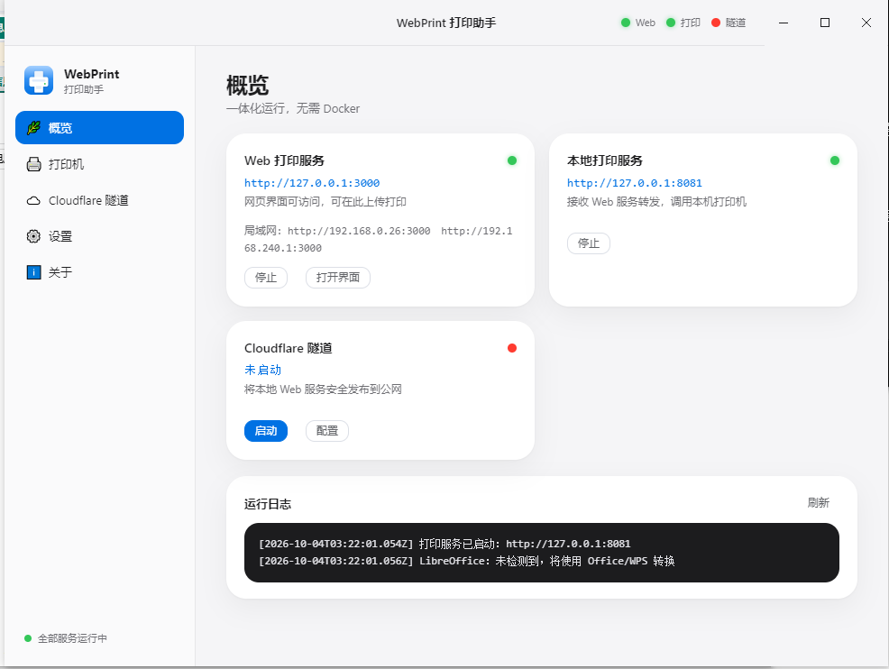
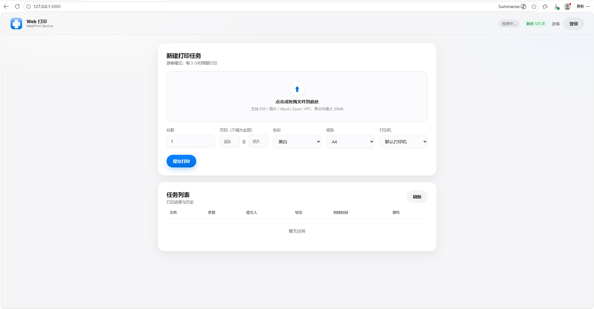

# web-print · WebPrint 打印助手

[](./LICENSE)
[](https://github.com/miralexand/web-print/releases)
[](#)
[](https://github.com/miralexand/web-print/actions/workflows/build-desktop.yml)

> 一个可自托管的网页打印系统。**一体化 Windows 桌面应用：一个程序同时内置网页打印服务、本地打印与 Cloudflare Tunnel。**

- 仓库地址：<https://github.com/miralexand/web-print>
- 下载地址：<https://github.com/miralexand/web-print/releases>
- 开源协议：[木兰宽松许可证 第2版 (MulanPSL-2.0)](./LICENSE)


---

## 界面预览

**桌面应用（概览 / 隧道 / 设置 / 关于）**



**网页端（本机 <http://127.0.0.1:3000>，局域网 `http://本机IP:3000`）**



## 快速开始

1. 打开 [Releases](https://github.com/miralexand/web-print/releases) 下载：
   - `WebPrintTray-Setup-<版本>.exe`（安装版，推荐）或
   - `WebPrintTray-<版本>-x64.zip`（免安装绿色版，解压双击 `WebPrintTray.exe`）
2. 运行程序，托盘出现图标，窗口自动打开，**网页服务与打印服务自动启动**。
3. 点「打开 Web 打印界面」，或访问 <http://127.0.0.1:3000>；默认账号 `admin / admin123`（登录后在「用户管理」中修改）。
4. 上传文件即可打印。需要外网访问时，在「Cloudflare 隧道」页启动隧道。

> 前置：本机打印机驱动已安装、Windows 可正常打印；Word/Excel/PPT 转 PDF 需本机安装 **WPS** 或 **Microsoft Office**（任一即可，默认 WPS 优先）。

## 核心亮点

- **一体化、零依赖**：一个桌面应用同时提供网页打印服务与本地打印，双击即用，无需任何额外服务。
- **文档转换双保险**：默认使用 **WPS 的 COM 转换**，失败时自动切换 **Microsoft Office 的 COM 转换**，无需另装转换工具。
- **Apple · 北欧极简 UI**：桌面端与网页端同一套设计语言（大圆角、柔和阴影、Apple 蓝、统一图标）。
- **双通道访问**：局域网直接用 `http://本机IP:3000`；外网用 Cloudflare Tunnel，快速隧道支持**关闭 / 刷新重建**。
- **完备的账号与配额**：游客默认每 3 小时 5 次；管理员可增删改用户并设置每人配额。
- **可靠的任务队列**：顺序执行、状态实时可见、失败自动重试、配额自动退还、任务可删除。
- **贴心的打印选项**：上传即时**文档预览**、**移除重选**、**起止页码**、份数、黑白/彩色、纸张、指定打印机。
- **托盘常驻**：关闭窗口最小化到系统托盘，托盘菜单可开关各服务。

## 功能特性

- **网页打印**：PDF、图片（PNG/JPG）、Office（Word/Excel/PPT）
- **文档预览与页码**：选择文件即时预览（PDF/图片内嵌），可填「第 X 页 至 第 Y 页」，可设份数
- **文档删除**：选错可一键移除重选；任务列表可删除记录
- **文档转换**：WPS → Microsoft Office COM 自动化
- **用户与配额**：游客配额、管理员用户管理（角色、启停、单独配额）
- **任务队列**：持久化、重启后可恢复记录、连接失败自动重试
- **Cloudflare Tunnel**：快速隧道 / 命名隧道（Token），快速隧道可关闭与刷新重建，内置傻瓜教程与免责声明
- **局域网访问**：Web 服务可绑定 `0.0.0.0`（设置中可关闭）
- **安全**：`scrypt` 密码哈希、登录防爆破、文件后缀 + 文件头校验、打印后清理临时文件
- **托盘与自启**：托盘常驻、开机自启、随程序启动隧道
- **关于页**：版本、仓库地址、问题反馈、检查更新、开源协议

## 技术栈

| 层 | 技术 |
| --- | --- |
| 桌面外壳 | **Electron 31**（原生标题栏 / 托盘 / IPC / 自动更新友好） |
| 界面 | **Vue 3 + Element Plus**，Apple / 北欧极简风格（桌面端与网页端统一） |
| 网页服务 | **Node.js 20 + Express**，`express-session` 会话、`multer` 上传 |
| 数据存储 | 本地 JSON 原子写入（用户、用量、任务），`scrypt` 密码哈希 |
| 打印 | **pdf-to-printer**（内置 SumatraPDF，调用 Windows 打印驱动） |
| 文档转换 | **WPS COM（KWPS/KET/KWPP）→ Microsoft Office COM（Word/Excel/PowerPoint）**，经 PowerShell 调用 |
| 内网穿透 | **Cloudflare Tunnel（cloudflared）**，快速隧道 / 命名隧道 |
| 打包发布 | **electron-builder**（NSIS 安装包 + 免安装 zip）+ **GitHub Actions** |

## 架构

```
浏览器（本机 / 局域网 / 公网）
   │ HTTP(S)
   ▼
WebPrintTray（单个 Electron 应用）
   ├── 内嵌 Web 服务（Express，端口 3000）── 网页界面 / API / 任务队列
   └── 内嵌打印服务（端口 8081）── WPS / Office 转 PDF + pdf-to-printer
                                        │
                                        ▼
                              Windows 打印服务 / 本地打印机

外网访问：Cloudflare Tunnel（cloudflared）→ http://127.0.0.1:3000
```

| 服务 | 默认地址 | 说明 |
| --- | --- | --- |
| Web 网页打印服务 | `http://127.0.0.1:3000` | 网页界面与接口，可在设置中改端口；默认允许局域网 |
| 本地打印服务 | `http://127.0.0.1:8081` | 接收转发、转换并调用打印机 |
| Cloudflare 隧道 | 启动后生成 | 把 Web 服务发布到公网 |

一次打印链路：浏览器上传 → Web 服务校验/配额/入队 → 打印服务转换（WPS/Office）→ 调用打印机 → 回传状态、清理临时文件。

## 端口与数据

- Web 服务默认绑定 `0.0.0.0`（局域网可访问）；如需仅本机使用，在「设置」关闭「局域网访问」。
- 数据目录：
  - 安装版：`%APPDATA%\WebPrintTray\`
  - 绿色版：在 exe 同目录放置空文件 `portable.flag`，数据即保存到 exe 同目录
  - 网页服务数据在 `web\data`（`users.json`、`usage.json`），日志在 `web\logs`，程序日志在 `desktop.log`
- 默认管理员：`admin / admin123`，请登录网页后尽快修改。

## Web 页面功能

- **上传**：拖拽 / 点击选择，选后**即时预览**（PDF、图片内嵌；Office 显示提示）
- **移除重选**：选错文件点「移除并重选」
- **打印参数**：起止页码、份数、色彩、纸张、指定打印机
- **任务列表**：状态与错误、创建时间，可**删除**（等待中的会退还配额）

## Cloudflare Tunnel 傻瓜教程

> 完整图文教程见 [`docs/cloudflare-tunnel.md`](./docs/cloudflare-tunnel.md)，应用内「Cloudflare 隧道 → 傻瓜教程」也有同款指引。

**方式一 · 快速隧道（30 秒上手）**

1. 模式选 **快速隧道**，目标地址保持 `http://127.0.0.1:3000`
2. 首次启动会弹出**公网访问免责声明**，勾选「下次不再提醒」后同意
3. 点 **保存并启动** → 得到形如 `https://xxxx.trycloudflare.com` 的公网地址
4. 可随时 **刷新重建**（换新地址）或 **关闭快速隧道**

**方式二 · 命名隧道（固定域名，推荐）**

1. 把域名接入 Cloudflare（修改 NS 服务器）
2. Cloudflare 控制台 → **Zero Trust → Networks → Tunnels → Create a tunnel**（类型 Cloudflared）
3. 复制 **Tunnel Token**
4. 该隧道 **Public Hostname** 添加：Type=`HTTP`，URL=`127.0.0.1:3000`，Subdomain 自定义
5. 回到应用：模式选 **命名隧道** → 粘贴 Token → **保存并启动**
6. 访问 `https://你的子域名.你的域名`

**安全建议**：修改默认账号密码；可在 Cloudflare **Access** 增加登录策略。

### ⚠️ 公网访问免责声明

首次启用任何公网访问（快速/命名隧道）前，应用会弹出免责声明，可勾选「下次不再提醒」。要点：

- 公网访问会把本机打印能力暴露到互联网，存在被滥用的风险。
- 快速隧道地址随机、可能随时失效或中断，**可用性不作保证**。
- **政企 / 事业 / 涉密单位请注意**：请勿通过公网隧道传输涉密、敏感或内部文件；如确需使用，请遵守本单位信息安全与保密规定并完成审批。
- 请设置强密码并及时修改默认账号，建议叠加 Cloudflare Access。
- 因启用公网访问产生的任何风险与后果，均由使用者自行承担。

## 用户与配额

- **游客（未登录）**：默认每 3 小时最多 5 次；按客户端 IP 计数，超限返回 `429`，失败/取消自动退还。
- **用户与管理员**：管理员可新增/修改/停用/删除用户并设置每人配额；系统始终保留至少一名启用管理员。

## 接口（内嵌 Web 服务，端口 3000）

| 方法 | 路径 | 鉴权 | 说明 |
| --- | --- | --- | --- |
| GET | `/health` | 否 | 健康检查 |
| POST | `/api/login` · `/api/logout` · GET `/api/me` | 否 | 登录 / 退出 / 身份与配额 |
| POST | `/api/print` | 否* | 上传并创建打印任务（支持 `pages`、`copies` 等） |
| GET | `/api/tasks` · GET/DELETE `/api/tasks/:id` | 否* | 任务列表 / 详情 / 删除 |
| GET | `/api/printers` · `/api/status` | 否 | 打印机列表 / 打印服务在线状态 |

管理员接口：`GET/POST /api/admin/users`、`PATCH/DELETE /api/admin/users/:id`、`GET /api/admin/usage`、`POST /api/admin/usage/reset`。

> `否*`：无需登录即可访问，但未登录身份按 IP 计入游客配额。

## 安全建议

1. 使用强密码，及时修改默认 `admin/admin123`
2. 公网访问前阅读免责声明；政企/涉密单位请勿传输涉密文件
3. 文件校验：后缀白名单 + 文件头 + 大小限制，打印后清理临时文件
4. 建议为公网域名叠加 Cloudflare Access；本地打印服务默认仅监听 `127.0.0.1`
5. 及时更新到最新 Release

## 从源码构建

```bash
# 依赖 Node.js 20+
cd desktop
npm install
npm start           # 开发运行（自动把 ../src 复制为内置服务）
npm run dist        # 打包，产物在 desktop/release/
npm run vendor      # 同步 Vue / Element Plus 本地资源
```

产物：

- `WebPrintTray-Setup-<版本>.exe`：NSIS 安装包
- `WebPrintTray-<版本>-x64.zip`：免安装绿色版

**GitHub Actions 自动构建**：推送 `v*` 标签自动构建并发布 Release，也可在 Actions 页手动触发。

### 代码签名（可选，可消除杀软误报）

在仓库 `Settings → Secrets and variables → Actions` 添加 `WINDOWS_CSC_LINK`（`.pfx` 的 base64 或 URL）与 `WINDOWS_CSC_KEY_PASSWORD`，之后构建会自动签名。

> Windows 上若打包时下载 Electron 出现证书错误，可设置 `NODE_OPTIONS=--use-system-ca`，必要时配合镜像 `ELECTRON_BUILDER_BINARIES_MIRROR=https://npmmirror.com/mirrors/electron-builder-binaries/`。

## 项目结构

```
web-print/
├── src/                       # 网页服务源码（构建时复制进桌面应用）
│   ├── app.js                 # Express：会话、静态资源、路由、start/stop
│   ├── config.js
│   ├── middleware/ routes/ services/ public/
├── desktop/                   # Electron 桌面应用（主交付）
│   ├── main.js                # 窗口、托盘、内嵌 Web/打印/隧道生命周期
│   ├── preload.js
│   ├── lib/printService.js    # 本地打印 + WPS/Office 转换
│   ├── lib/cloudflared.js     # Cloudflare Tunnel 管理
│   ├── renderer/              # Apple 风格界面（Vue3 + Element Plus）
│   ├── scripts/               # copy-server.js / copy-vendor.js / make-icons.js
│   └── build/                 # 图标资源（icon.svg / icon.png / icon.ico / tray.png）
├── docs/                      # 教程与截图
├── .github/workflows/         # GitHub Actions 构建与发布
└── LICENSE
```

## 开源协议

本项目基于 [木兰宽松许可证 第2版 (MulanPSL-2.0)](./LICENSE) 开源。

```
Copyright (c) 2026 miralexand
web-print is licensed under Mulan PSL v2.
You can use this software according to the terms and conditions of the Mulan PSL v2.
You may obtain a copy of Mulan PSL v2 at:
         http://license.coscl.org.cn/MulanPSL2
```

## Star History

[](https://star-history.com/#miralexand/web-print&Date)
